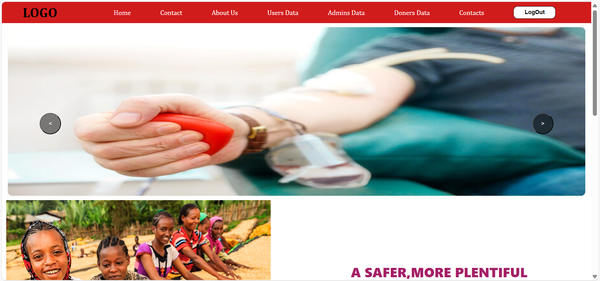
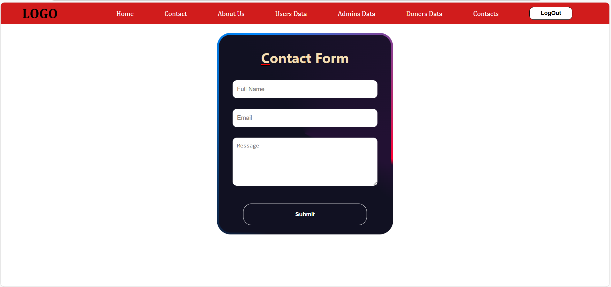
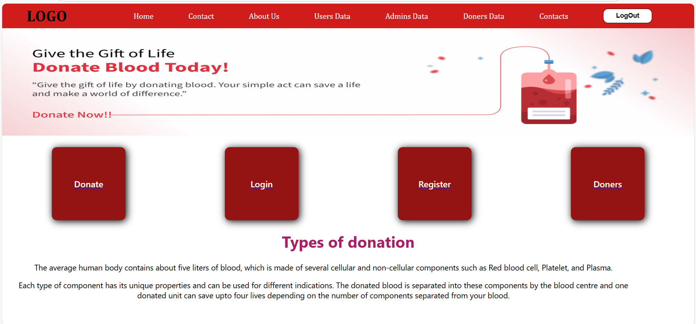
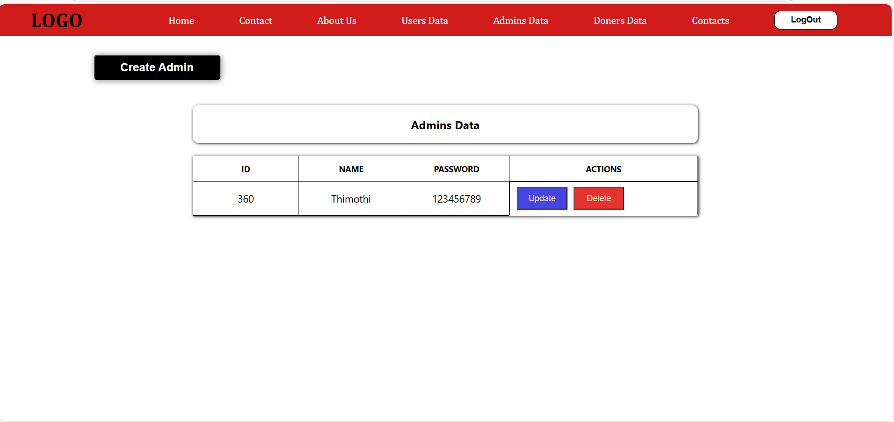

---

# 🩸 Blood Donation Platform (Full Stack)

A web application to simplify and manage blood donations, user registrations, donor submissions, and admin control.

---

## 🔧 Tech Stack

| Layer       | Tech Used                     |
| ----------- | ----------------------------- |
| Frontend    | React.js, Axios, CSS          |
| Backend     | Node.js, Express.js           |
| Database    | MongoDB (via Mongoose)        |
| Auth        | JWT (for Users & Admins)      |
| File Upload | Multer (for donor photos)     |

---

## 🗂️ Project Structure

```
BloodDonationManagementSystem/
├── Back-end/         # Node.js + Express + MongoDB
├── front-end/        # React
└── README.md
```

---
## 🎨 Frontend Pages (React)

| Route              | Purpose                                 |
| ------------------ | --------------------------------------- |
| `/`                | Home Page with navigation               |
| `/reg`             | User registration page                  |
| `/login`           | User login page                         |
| `/donate`          | Donor submission form with image upload |
| `/doners`          | Donors list with contact details        |
| `/submits`         | User’s submitted donors                 |
| `/contact`         | Contact form                            |
| `/adminLog`        | Admin login                             |
| `/admins`          | Admins data                             |
| `/users`           | Manage all users                        |
| `/donersList`      | View/update/delete all donors           |
| `/contacts`        | View submitted contact messages         |

---

## 🔐 Authentication

* Uses JWT tokens stored in **localStorage**
* Protected routes via middleware in backend
* Role-based access for **users** and **admins**

---

## 🧪 Backend API Endpoints

Full list of backend endpoints is available in the backend section. Highlights include:

* `POST /api/register`, `POST /api/login`
* `POST /api/donate`, `GET /api/submits`
* `POST /adminLog`, `GET /admins`
* `GET /api/users`, `GET /api/admin/doners`, `GET /api/contacts`

> Tokens must be sent as `token` in request headers.

---

## 📁 Environment Config (Optional)

If you refactor to use `.env`, sample:

```env
PORT=5000
MONGO_URL=mongodb://localhost:27017/blooddb
JWT_SECRET=THIMOTHI
ADMIN_SECRET=Admin
```

---

## 📸 Donor Image Uploads

Uploaded files are stored in `/backend/DonersImages/`
Images are accessible via:

```
http://localhost:4000/DonersImages/<filename>
```

---

## ✅ Features

### 👤 Users

* Register/Login
* Donate blood with image
* View/delete submissions

### 🛡️ Admin

* Login securely
* View/update/delete all users and donors
* Manage contact submissions
* Add/update/delete admin users

---

## ⚠️ Security Notes

* Passwords are currently stored as **plain text** (not secure).

  > 🔐 **Hash passwords with `bcrypt` for production.**
* JWT secrets are hardcoded. Use `.env` for production.

---

## 📬 Contact

Developed by: **\THIMOTHI**
Email: \[[btt6303273@gmail.com](mailto:your.email@example.com)]

---
## 🖼️ Screenshots

###  Home Page

###  Contact Page

###  About Page

###  User Login Page

###  User Register Page
)
###  Admin Login Page

###  Admin Data Page



